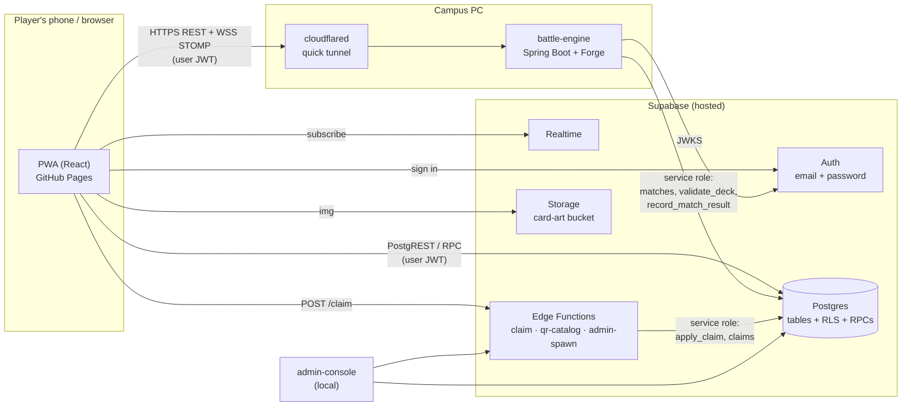
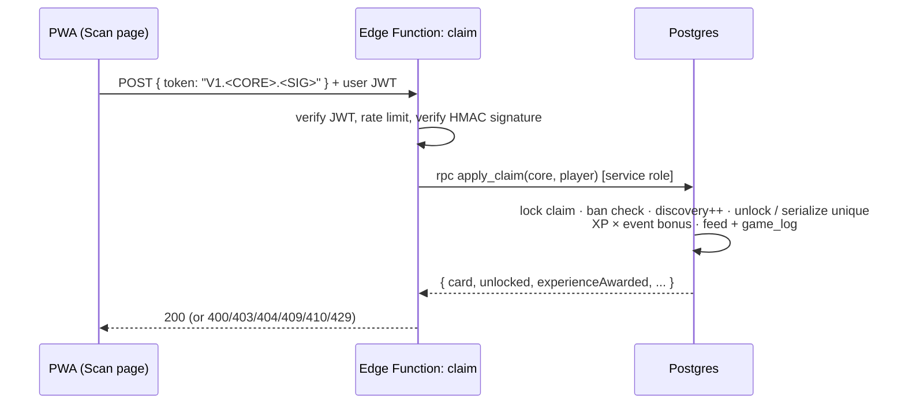

# Architecture

## Components

- **The web app talks to Supabase directly.** There is no application server between them. Every read and
  write is checked by Postgres row-level security (RLS) or by a `SECURITY DEFINER` function that enforces the
  game rules. The publishable (anon) key is public by design.
- **Edge Functions** run the few things that must hold a secret: verifying and minting signed QR tokens
  (`QR_SIGNING_SECRET`) and calling service-role-only functions.
- **The battle engine** runs real Magic rules (Forge) in memory. It trusts only the player's Supabase access
  token (verified against the project's JWKS) and writes match rows and results with the service-role key.
  Forge itself never touches Postgres.
- **Realtime** pushes new feed entries, trade offers and the battle engine's current URL to open clients.

## Key flows

### Claim a card (scan a QR code)

### Battle

1. Player A: `POST /api/v1/battle/lobby` (deck) → the engine validates the deck (`validate_deck`), inserts a
   `WAITING` match row and returns a 6-character battle code.
2. Player B: `POST /api/v1/battle/join` (code, deck). The engine atomically claims the lobby
   (`WAITING → ACTIVE`), converts both decks and starts a Forge game in memory.
3. Both clients open a native WebSocket to `/ws/match` (STOMP, token on CONNECT), subscribe to
   `/topic/match/{id}/p{seat}` for state, and send choices to `/app/match/{id}/action`.
4. On game over (or a concede, or a disconnect longer than 60 s), the engine calls `record_match_result`. That
   awards the winner 50 XP × the event bonus and writes `game_log` MATCH rows for both players.

### Finding the battle engine

The engine runs on a campus PC behind a Cloudflare **quick tunnel**, whose public URL changes every time it
starts. `battle-engine/start-public.ps1` writes the current URL to the public `app_config` table; the PWA reads
it at startup, checks the engine answers, and follows changes live over Realtime. The Battle tab only shows
while an engine is reachable. See [battle-engine.md](battle-engine.md#hosting).

## Where state lives

| Data | Home | Notes |
| --- | --- | --- |
| Accounts, profiles, XP, bans | `auth.users`, `profiles` | profile row created by a signup trigger |
| Card catalog, formats, legalities | `cards`, `formats`, `card_legalities` | public read |
| Collection | `player_unlocks`, `unique_cards`, `discoveries`, `favorites` | written by game functions |
| Decks | `decks`, `deck_cards` | owned by the player |
| Matches (results) | `matches` | written by the battle engine |
| Live match state | battle-engine memory | lost if the engine restarts |
| Trades | `trades`, `trade_cards` | via trade RPCs |
| QR tokens | `claims` | printed (deterministic) or spawned (random) |
| Events, achievements | `events`, `player_achievements` | |
| History | `game_log` (durable) · `activity_feed` (last 50, UI) | |
| Runtime settings | `app_config` | public; e.g. the battle engine URL |
| Card images | Storage bucket `card-art` | public |

Details: [database.md](database.md).
